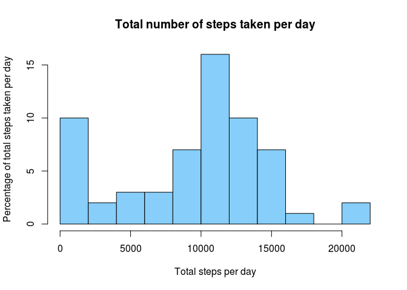
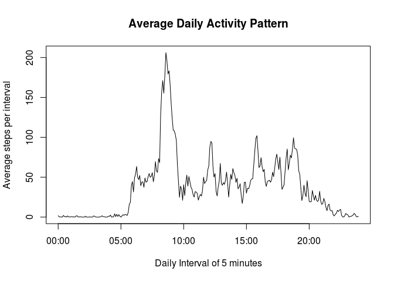
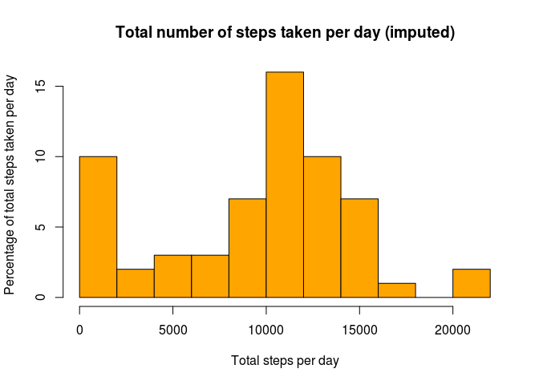
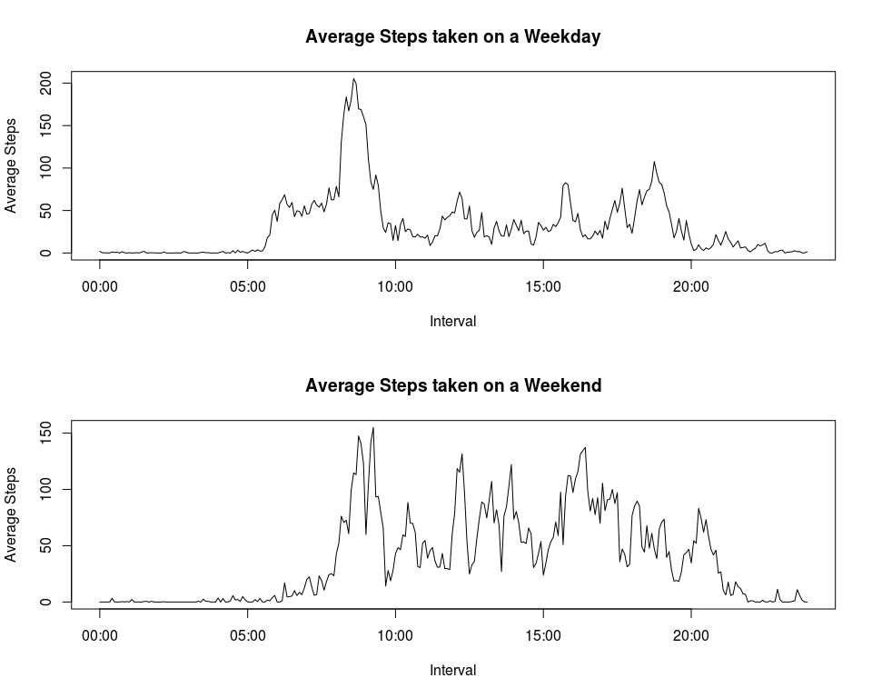

# Reproducible Research: Peer Assessment 1
- By Yang Yuzhong

The activity.csv contains a total of 17,568 observation of the variables:

- **steps**: Number of steps taking in a 5-minute interval (missing values are coded as NA)

- **date**: The date on which the measurement was taken in YYYY-MM-DD format

- **interval**: Identifier for the 5-minute interval in which measurement was taken

## Loading required R packages
Libraries required to perform the peer assessment is loaded.
Options in R environment are updated so that numbers >= 10^5 will be denoted in 
scientific notation (scipen = 1), and rounded to 2 digits (digits = 2). This
is to beautify subsequent numeric output in the peer assessment.

```r
library(dplyr)
```

```
## 
## Attaching package: 'dplyr'
## 
## The following object is masked from 'package:stats':
## 
##     filter
## 
## The following objects are masked from 'package:base':
## 
##     intersect, setdiff, setequal, union
```

```r
library(ggplot2)
options(scipen = 1, digits = 2)
```

## Loading and preprocessing the data

activity.csv is first loaded using `read.csv()` function.


```r
activity<-read.csv("activity.csv")
```

The format of the loaded table is then changed to the following with select 
function from dply:

| date | interval | steps |
| ---- | -------- | ----- |
| 2012-10-01 | 0 | NA |
| ... | ... | ... |


```r
activity<-activity %>% 
select(date,interval,steps)
```

## What is mean total number of steps taken per day?

To obtain the mean total number of steps taken per day, the total steps per day
is first calculated. This is done through `group_by()` _date_ then `summarize()` 
which performs the `sum()` function on each day.


```r
dailytotalsteps <- activity %>% 
    group_by(date) %>% 
    summarize(steps = sum(steps,na.rm=TRUE))
```

The histogram shows the distribution of the total number of steps per day.


```r
hist(dailytotalsteps$steps,
     breaks=10,
     col="lightskyblue",
     main="Total number of steps taken per day",
     xlab="Total steps per day",
     ylab="Percentage of total steps taken per day")
```

 

With the total number of steps taken per day, the mean and median is easily
calculated with the corresponding function.


```r
meansteps<-mean(dailytotalsteps$steps)

mediansteps<-median(dailytotalsteps$steps)
```

| mean total steps per day | median total steps per day | 
| ---- | ------ | 
| 9354.23 | 10395 | 

## What is the average daily activity pattern?

To obtain the average daily activity pattern, `group_by()` is first performed on
_interval_ then `mean()` of _steps_ are taken for each _interval_

```r
dailypattern<-activity %>% 
    group_by(interval) %>% 
    summarize(steps = mean(steps,na.rm=TRUE))
```

In order to plot the time series for the average daily pattern, 
the column _interval_ from the dataset must be converted from numeric data type
to time type. 

Using `sprintf()` on _interval_ column of _dailypattern_ to format it into 4 
digit format. Next, `strptime()` is performed on the formatted _interval_ column
to convert it into a proper time type. Then the new time type _dateinterval_
column is binded into _dailypattern_ using `cbind()`

```r
dateinterval<-strptime(sprintf("%04d", dailypattern$interval), format="%H%M")
dailypattern<- cbind(dailypattern,dateinterval)
```

Lastly, time series plot is achieved by plotting the time interval against 
steps with proper labels for the plot.

```r
plot(dailypattern$dateinterval,
     dailypattern$steps,type="l",
     main="Average Daily Activity Pattern",
     xlab="Daily Interval of 5 minutes",
     ylab="Average steps per interval")
```

 

The 5-minute interval, on average across all the days in the dataset, 
that contains the maximum number of steps is obtained using `which.max()`
and subsetting _interval_.

```r
maxstepinterval<-dailypattern$interval[which.max(dailypattern$steps)]
```

The 5-minute interval with maximum number of steps is 835

## Imputing missing values

### 1) Total number of missing values in the dataset


```r
num.na<-sum(is.na(activity$steps))
```

The total number of missing values in the dataset is 2304

### 2) Strategy for filling in all missing values in dataset

1) Obtain the median of steps for each interval per day

```r
dailymedian<-activity %>% 
    group_by(interval) %>% 
    summarize(mediansteps = median(steps,na.rm=TRUE))
```

2 & 3. Create new dataset _imputdata_ using `left_join()` to retain all rows
in the original dataset and to join with the daily median of steps across
the entire dataset. Lastly, replace the rows with _NA_ with daily median steps
for the corresponding interval.

```r
imputdata<- activity %>%
    left_join(dailymedian, by = "interval") %>%
    mutate(steps=ifelse(is.na(steps), mediansteps, steps))
```

4) Histogram of the total number of steps taken each day and the mean 
and median total number of steps taken per day.

The total number of steps taken each day for the imputed data is calculated
using `group_by()` on _date_ then `sum()` on _steps_

```r
imputtotalsteps <- imputdata %>% 
    group_by(date) %>% 
    summarize(steps = sum(steps,na.rm=TRUE))
```

The histogram shows the distribution of the total number of steps per day on 
the imputed data.

```r
hist(imputtotalsteps$steps,
     breaks=10,
     col="orange",
     main="Total number of steps taken per day (imputed)",
     xlab="Total steps per day",
     ylab="Percentage of total steps taken per day")
```

 

The mean and median total steps per day is calculated with its corresponding 
functions and presented in the table.

```r
meanimputsteps<-mean(imputtotalsteps$steps)

medianimputsteps<-median(imputtotalsteps$steps)
```

| mean total steps per day | median total steps per day | 
| ---- | ------ | 
| 9503.87 | 10395 | 

With the NA values imputed with the average median steps of the dataset for a
particular interval, only the mean of the imputed data is different from the
estimates from the first part of the assignment.

The mean is now 9503.87 as compared to 9354.23 previously. 
The imputing of data has caused the mean of the dataset to shift higher as 
median of the average of steps in a particular interval across the dataset is
added to the mean calculation while keeping the median the same.

## Are there differences in activity patterns between weekdays and weekends?

In order to plot the time series to determine if there are differences in
activity patterns between weekdays and weekends, the column _interval_ from 
the dataset must be converted from numeric data type to time type, like in
previous part of the assignment.

Using `sprintf()` on _interval_ column of _dailypattern_ to format it into 4 
digit format. Next, `strptime()` is performed on the formatted _interval_ column
to convert it into a proper time type. Then the new time type _imputinterval_
column is binded into _imputdata_ using `cbind()`

```r
imputinterval<-strptime(sprintf("%04d", imputdata$interval), format="%H%M")
imputdata<- cbind(imputdata,imputinterval)
```

In order to determine whether a date is weekday or weekend, `weekdays()` is
applied to _date_ column of _imputdata_ from the previous step and the result
is added to a new _day_ column with the string of days in the week.

Next, a nested `ifelse()` is performed on _day_ column to change string of days
into 0 if it is a weekday and 1 if it is a weekend. Following this, `factor()`
is applied to the now numeric _day_ column to tag 0s as "Weekday" and
1s as "Weekend".

Lastly, `select()` is used to pick up the time type _imputinterval_,
_day_ and _steps_ to properly format the imputed data for the time series plot.

```r
imputweekdays<- imputdata %>%
    mutate(day=weekdays(as.Date(imputdata$date))) %>%
    mutate(day=ifelse(day=="Saturday",1,ifelse(day=="Sunday",1,0))) %>%
    mutate(day=factor(day,labels = c("Weekday", "Weekend"))) %>%
    select(imputinterval,day,steps)
```

To obtain the average of steps across all interval for weekdays and weekends,
`group_by()` is performed first on _day_ then _imputinterval_ column. Lastly, 
`mean()` of the steps are computed according to the grouping.

```r
weekdaypattern<-imputweekdays %>% 
    group_by(day,imputinterval) %>% 
    summarize(steps = mean(steps,na.rm=TRUE))
```

Finally, the plot for Average steps on a weekday vs weekend are achieved
using `plot()` through _steps_ as x-axis and _imputinterval_ as y-axis.

```r
par(mfrow=c(2,1))
plot(weekdaypattern[weekdaypattern$day=="Weekday",]$imputinterval,
     weekdaypattern[weekdaypattern$day=="Weekday",]$steps,type="l",
     main="Average Steps taken on a Weekday",
     xlab="Interval",ylab="Average Steps")

plot(weekdaypattern[weekdaypattern$day=="Weekend",]$imputinterval,
     weekdaypattern[weekdaypattern$day=="Weekend",]$steps,type="l",
     main="Average Steps taken on a Weekend",
     xlab="Interval",ylab="Average Steps")
```

 
